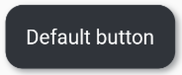
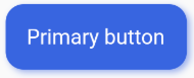
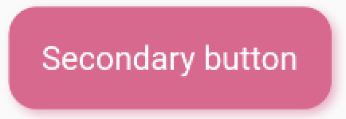
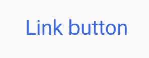
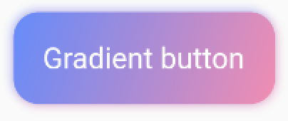

# Components

## Button

### BdButton



```dart
BdButton(
  backgroundColor: BdBlack.color,
  onTap: () {
    print("clicked normal button");
  },
  child: Text(
    "button",
    style: TextStyle(color: Colors.white, fontSize: BdFontSize.md),
  ),
)
```

### BdPrimaryButton



```dart
BdPrimaryButton(
  label: "primary button",
  onTap: () {
    print("clicked primary button!");
  },
)
```

### BdSecondaryButton



```dart
BdSecondaryButton(
  label: "secondary button",
  onTap: () {
    print("clicked secondary button!");
  },
)
```

### BdLinkButton



```dart
BdLinkButton(
  label: "link button",
  onTap: () {
    print("clicked link button!");
  },
)
```

### BdGradientButton



```dart
BdGradientButton(
  child: Text(
    "Gradient button",
    style: TextStyle(color: Colors.white, fontSize: BdFontSize.md),
  ),
  onTap: () {
    print("clicked gradient button!");
  },
)
```